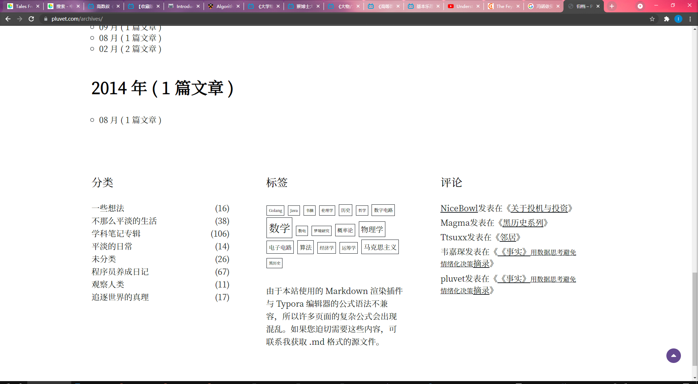
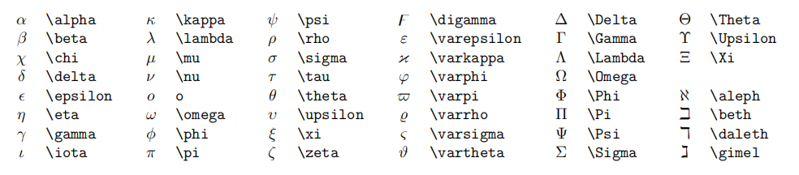

# Hello,world!

# 一级标题

## 二级标题

### 三级标题

每写完一个段落要隔一行空行.

就像这样, 隔了一行空行.

---

分割线

**重点加粗**

*斜体*

~~删除线~~

==高亮==

选中文本之后, 按下 Ctrl + B 可以给选中文本加粗.

同理 Ctrl + I 可以让选中文本变为斜体.

---

列表:

* 无序列表
  * 嵌套无序列表
  * 嵌套无序列表

* 无序列表
* 无序列表

1. 有序列表 1
   1. 嵌套有序列表 1
   2. 嵌套有序列表 2
2. 有序列表 2
3. 有序列表 3

任务列表:

- [x] 已经完成的事 1
- [x] 已经完成的事 2
- [x] 已经完成的事 3
- [ ] 仍未完成的事 4
- [ ] 仍未完成的事 5

要进行缩进 (书写嵌套列表), 你可以使用 VSCode 的快捷键 Ctrl + [ 和 Ctrl + ].

这个快捷键可以将代码向左或向右进行缩进!

---

引用文本:

> 引用别人说的话
> 就这样写
> By. OrangeX4

---

这是 `行内代码` 语法.

代码块语法:

``` python
print("Hello, World!")
```
代码行数的显示:

``` javascript {.line-numbers}
function add(x, y) {
  return x + y
}
```

注意要将 ' 替换成 `.

请将 ' 替换成 `.

---

[超链接名称](链接地址)


---

表格:

| 表头 | 表头 |
| ---- | ---- |
| 内容 | 内容 |
| 内容 | 内容 |

拓展语法:

| 表头 | 表头 |
| ---- | ---- |
| 内容 | 内容 |
| >    | 内容 |

| 表头 | 表头 |
| ---- | ---- |
| 内容 | 内容 |
| ^    | 内容 |

快捷键:

自动表格对齐: Shift + Alt + F

---

注释:

<!-- 你看不见我 -->
你可以随手做点草稿, 如果还想保留着, 但是不显示, 就可以按下快捷键 Ctrl + \ 将当前行注释 / 反注释.

行内公式: 

单位圆 $x^2+y^2=1$

公式块:

$$
\begin{cases}
x=\rho\cos\theta \\
y=\rho\sin\theta \\
\end{cases}
$$

上标 $x^2 + y^{12} = 1$

上标 $x_1 + y_{12} = 1$

较小的行内行分数 $\frac{1}{2}$

展示型的分式 $\displaystyle\frac{x+1}{x-1}$

开平方 $\sqrt{2}$

开 $n$ 次方 $\sqrt[n]{2}$

紧贴 $a\!b$

没有空格 $ab$

小空格 $a\,b$

中等空格 $a\;b$

大空格 $a\ b$

quad 空格 $a\quad b$

两个 quad 空格 $a\qquad b$

累加 $\sum_{k=1}^n\frac{1}{k}  \quad  \displaystyle\sum_{k=1}^n\frac{1}{k}$

累乘 $\prod_{k=1}^n\frac{1}{k}  \quad  \displaystyle\prod_{k=1}^n\frac{1}{k}$

积分 $\displaystyle \int_0^1x{\rm d}x  \quad  \iint_{D_{xy}}  \quad  \iiint_{\Omega_{xyz}}$

圆括号 $\displaystyle \left(\sum_{k=1}^{n}\frac{1}{k} \right)^2$

方括号 $\displaystyle \left[\sum_{k=1}^{n}\frac{1}{k} \right]^2$

花括号 $\displaystyle \left\{\sum_{k=1}^{n}\frac{1}{k} \right\}^2$

尖括号 $\displaystyle \left\langle\sum_{k=1}^{n}\frac{1}{k} \right\rangle^2$

居中:

$$
\begin{aligned}
y &=(x+5)^2-(x+1)^2 \\
&=(x^2+10x+25)-(x^2+2x+1) \\
&=8x+24 \\
\end{aligned}
$$

左对齐:

$
\begin{aligned}
y &=(x+5)^2-(x+1)^2 \\
&=(x^2+10x+25)-(x^2+2x+1) \\
&=8x+24 \\
\end{aligned}
$


$$
\begin{cases}
k_{11}x_1+k_{12}x_2+\cdots+k_{1n}x_n=b_1 \\
k_{21}x_1+k_{22}x_2+\cdots+k_{2n}x_n=b_2 \\
\cdots \\
k_{n1}x_1+k_{n2}x_2+\cdots+k_{nn}x_n=b_n \\
\end{cases}
$$

矩阵:

$$
\begin{pmatrix}
1 & 1 & \cdots & 1 \\
1 & 1 & \cdots & 1 \\
\vdots & \vdots & \ddots & \vdots \\
1 & 1 & \cdots & 1 \\
\end{pmatrix}

\quad

\begin{bmatrix}
1 & 1 & \cdots & 1 \\
1 & 1 & \cdots & 1 \\
\vdots & \vdots & \ddots & \vdots \\
1 & 1 & \cdots & 1 \\
\end{bmatrix}
$$

行列式: 

$$
\begin{vmatrix}
1 & 1 & \cdots & 1 \\
1 & 1 & \cdots & 1 \\
\vdots & \vdots & \ddots & \vdots \\
1 & 1 & \cdots & 1 \\
\end{vmatrix}
$$


Ctrl + M 进入数学公式模式 (加入美元符)