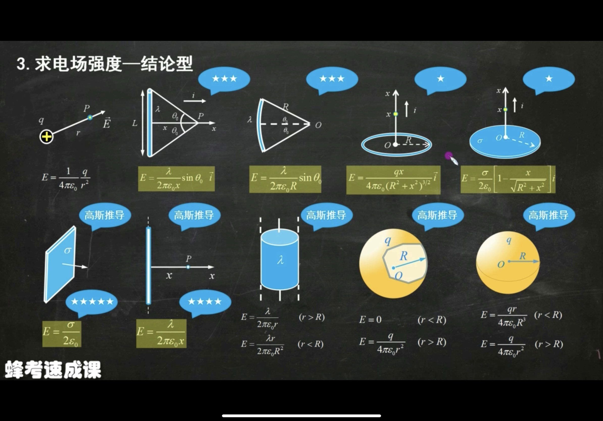
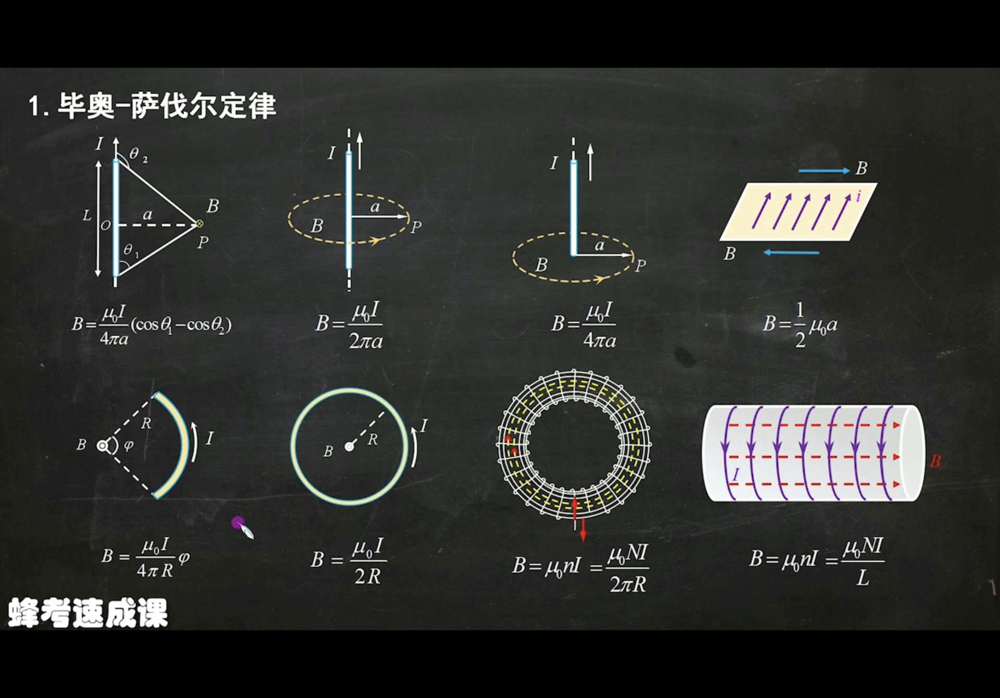
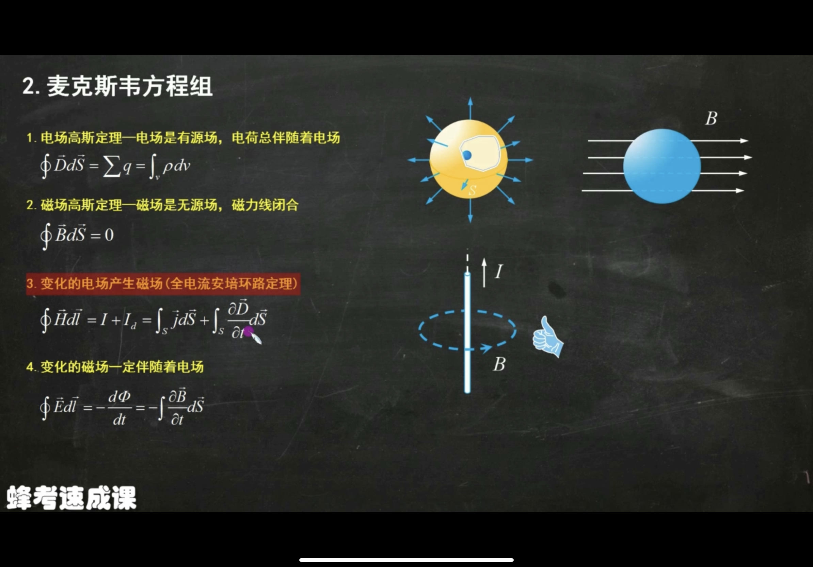
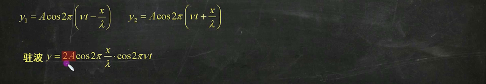
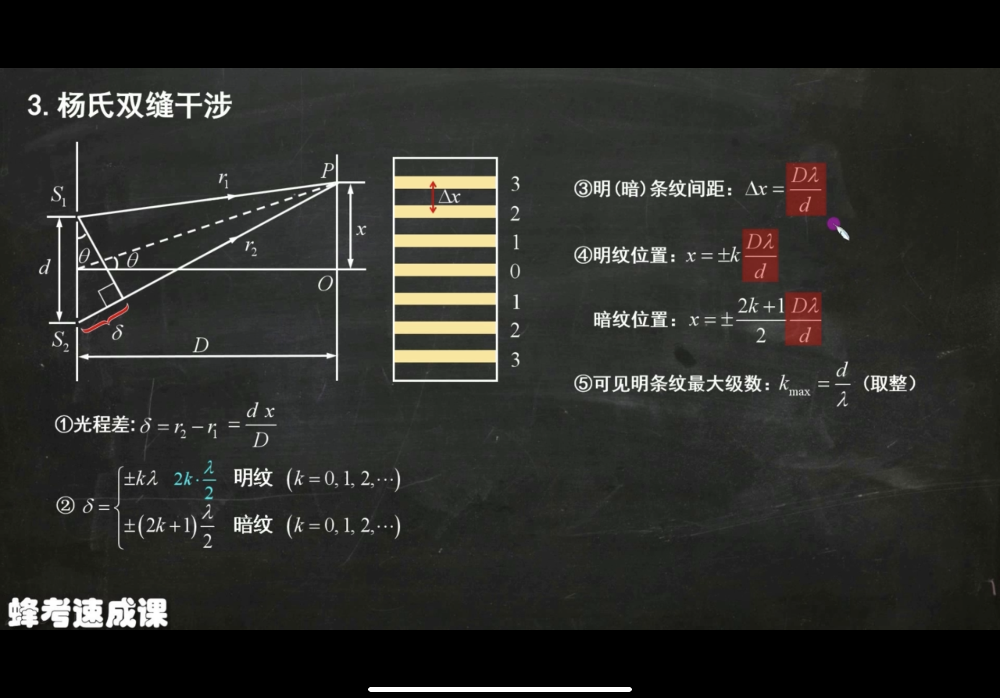
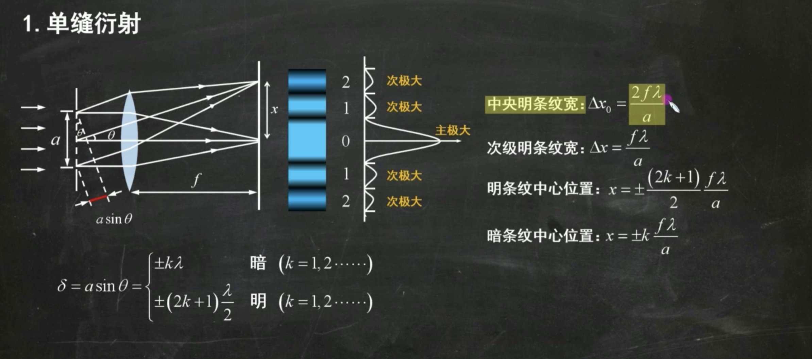

# 力学
## 第一章 质点运动学
* 质点运动的描述
* 切向加速度和法向加速度
* 运动的相对性

1. 匀加速直线
    $v=v_0+at$
    $x=x_0+v_0t+\frac{1}{2}at^2$
    $v^2-v_0^2=2a(x-x_0)$
2. 抛体运动
    $a_x=0 v_x=v_{0x}$
3. 相对运动
    * 画图
    * 谁在前面箭头指向谁
4. 角速度、角加速度
    同直线运动
5. 匀加速圆周运动
    $\omega=\omega_0+at$
    $\theta=\theta_0+\omega_0t+\frac{1}{2}at^2$
6. 切向加速度、法向加速度
   法向加速度$a_n=\omega^2R=\frac{v^2}{R}$
   切向加速度$a_t=\alpha R=\frac{dv}{dt}$ （$\alpha$是角加速度）
   总加速度$a=\sqrt{a_n^2+a_t^2}$
   总加速度与$a_n$夹角$\gamma=arctan|\frac{a_t}{a_n}|$

    

## 第二章 质点动力学
### 牛顿定律
### 能量表述
### 动量表述
---
# 电磁学
## 第一章 真空中的静电场
### 电场、电场强度
1. 离散型
**库仑定律** $\epsilon_0=8.85*10^{-12} C^2/(N*m^2)$
点电荷:$E=\frac{1}{4\pi\epsilon_0}*\frac{q}{r^2}$
2. 连续型
均匀带电细棒:$dE=\frac{1}{4\pi\epsilon_0}*\frac{dq}{r^2}$ 
$\int dE=\int \frac{1}{4\pi\epsilon_0}*\frac{dq}{r^2}$
把dq用已知量表示，如棒状物体表示为dx，再到L求积分
3. 结论型
横杆、圆弧、圆环、圆盘、无限大平面、无限长直导线、圆柱、球

### 静电场中的高斯定理

**电通量**： $\Phi=E S$
* E和S必须是垂直关系
* 对于曲面，向外穿出为负，向内穿入为正

**高斯定理** ：闭合曲面的电通量等于包含电荷量除以 $\epsilon_0$
求电场强度
高四面上的电场E不仅由面内电荷影响也由面外电荷影响

### 静电场的环路定理、电势
*电场力做功与路径无关→电场力是保守力→电势能→电势零点*
**$W=\frac{qq_0}{4\pi\epsilon_0r}$**
1. 离散型（点）
$V=\frac{q}{4\pi\epsilon r}$
2. 连续型（某种图形）
$dV=\frac{dq}{4\pi\epsilon_0r} V=\int \frac{dq}{4\pi\epsilon_0r}$
   * 圆环、半圆环、部分圆环 在圆心处：$V_0=\frac{Q}{4\pi\epsilon_0R}$
1. 已知场强求电势==必考==
$V=\int_{begin}^\infty E dl$
**电势是标量**
球壳内，电场强度为0，电势处处相等，*等效为球壳表面电势*
球壳外，电场强度等于把球壳等效为点电荷时的电场强度，电势一样
   * 通过高斯定理求解场强
   * 通过场强写出电势分布
  

## 第二章 静电场中的导体
### 静电平衡==必考==
**导体**
1. 电荷分布在表面，内部电场强度为0， 表面$E = \frac{\sigma}{\epsilon_0}$
2. 内部电场强度为0是外部电荷和表面的感应电荷共同作用的结果
3. 导体等势体，表面是等势面，场强并非处处相等
4. 导体表面曲率越大，电荷量密度越大

### 电容器
1. 电容器由导体构成，电荷等值异号分布在极板内测
2. $E=\frac{\sigma}{\epsilon_0}=\frac{U}{d}$         $F=\frac{1}{2}E d$
3. 含介质：$C=\epsilon_r C_0$      $ E=\frac{E_0}{\epsilon_r}$
4. 电容大小只与介质、材料、位置有关 $C=\frac{\epsilon_0 S}{d}$
5. 电容串并联和电阻相反
6. 球形电容器用高斯定理
### 导体和电场能量

## 第三章 真空中的恒稳磁场
### 磁感应强度
**毕萨定律**：$dB=\frac{\mu_0}{4\pi}\frac{Idl sin\theta}{r^2}$

### 磁场中的高斯定理==必考==
$\Phi=BS$
**磁场中高斯定理**：$\Phi=\int BdS=0$
### 磁场中的安培环路定理
**安培环路定理**：$\int B dl=\mu_0\Sigma I_内$
*对于直导线*：$B \int dl=B 2\pi r=\mu_0\Sigma I_内$
$B=\frac{\mu_0\Sigma I_内}{2\pi r}$ ，
### 安培力、洛伦兹力、磁矩、磁力矩
**安培力**: $F=BIL$
磁矩：$p_m=IS$右手大拇指指向为磁矩方向
磁力矩：$M=Bp_msin\theta(\theta是B和p_m的夹角）$
磁力矩做功：$A=I\Delta\Phi_m$
**洛伦兹力**：$F=qBv$

## 第四章 电磁感应
### 电磁感应定律
### 动生电动势、感生电动势==必考==
**1. 楞次定律**：阻碍磁通量变化
2. 感生：B变化，S不变 $\epsilon=-\frac{d\Phi}{dt}=\int E_kdl=-\int \frac{aB}{at}dS$
3. 动生：B不变，S变化 $V=BLv$
4. 引起感生电动势的非静电力是：**感生电场**
5. 静电场：保守场、有源场、非闭合
6. 感生电场：非保守场、无源场、有旋场、闭合
7. **右手定则**：四指I，拇指v
### 自感和互感
* **自感** $L=\frac{\Phi}{I}$  $ \epsilon=L\frac{dl}{dt}$
* **互感** $M=\frac{\Phi_2}{I_1}=\frac{\Phi_1}{I_2}$
* **麦克斯韦方程组**
  
### 磁场能、位移电流
---
# 振动与波
## 第一章 简谐振动
### 简谐运动的动力学特征

### 单摆
### 简谐运动的描述
1. **简谐运动方程**$x=Acos(\omega t+\phi_0)$
2. 振幅：$A=\sqrt{x_0^2+\frac{v_0^2}{\omega^2}}$
3. 角频率：$\omega=\sqrt{\frac{k}{m}}=\frac{2\pi}{T}$
4. 初相：$\phi_0$ 相位：$\omega t+\phi_0$
5. **旋转矢量法**==必会==：
6. 周期：$T=\frac{2\pi}{\omega}$
7. 频率：$v=\frac{1}{T}=\frac{\omega}{2\pi}$
8. 速度：位移对时间求导，顶端速度为零，平衡位置速度最大 $V_{max}=A\omega$
9. 加速度：速度对时间求导，伸长或缩短最大量（顶端位置）$a_{max}=A\omega^2$

### 简谐运动的合成、旋转矢量
### 简谐运动的能量
动能加势能

## 第二章 机械波
### 波动表达式
1. 求原点的振动方程(上坡下,下坡上)
2. 求波速$u=\frac{\lambda}{T}=\lambda v$
3. 同向加,反向减(相位差)
4. 相位差$\Delta\phi=\frac{2\pi}{\lambda} x$
5. $y=Acos(\omega(t-\frac{x}{u})-\phi_0)$

### 惠更斯原理、叠加定理、波的干涉
动能=势能
**波的干涉**
1. 同大同小,相干加强,一大一小,相干减弱
2. 相干条件:振动方向相同,频率相同,相位差恒定
3. $\Delta\phi=2k\pi$,相干加强
4. $\Delta\phi=(2k+1)\pi$,相干减弱
### 驻波、电磁波
驻波:

* 波节位置:奇数倍$\frac{\lambda}{4}$
* 波腹:偶数倍
* 相邻波节\波腹间距:$\frac{\lambda}{2}$
---
# 波动光学
## 第一章 光的干涉
### 相干光、光程
1. 获得相干光的两种方法：分波阵面法、分振幅法
2. 光程差： $\delta=nr$（几何路程差）r
3. 相位差：$\phi=\frac{2\pi\delta}{\lambda}$ 
### 杨氏双缝干涉实验

### 薄膜干涉
### 等厚等倾干涉
1. **等倾干涉**：$光程差\delta=2ndcos\gamma+\frac{\lambda}{2}$
    $\frac{\lambda}{2}$根据有无半波损失加上
2. 半波损失
   1. 半波损失存在于反射面
   2. 光疏到光密有半波损失
   3. 光密到光疏没有半波损失
3. 反射增强：明纹
4. 透射增强：（反射相消）暗纹
5. **劈尖干涉**：$光程差\delta=2ndcos\gamma+\frac{\lambda}{2}$
    $\frac{\lambda}{2}$根据有无半波损失加上
   1. 相邻两明（暗）纹高度差：$\Delta h=\frac{\lambda}{2n}$
   2. 相邻两明（暗）纹间距：$lsin\theta=\frac{\lambda}{2n}$
   3. 左凹右凸
6. 牛顿环
   1. 明纹半径$r=\sqrt{\frac{(2k-1)R\lambda}{2n}}$
   2. 暗纹半径$r=\sqrt{\frac{kR\lambda}{n}}$
7. 迈克尔逊干涉仪：$d=N\frac{\lambda}{2}$
### 惠更斯-菲涅尔原理

## 第二章 光的衍射
### 单缝衍射==必考==

1. 半角宽度：第一级暗纹的衍射角$asin\theta=\lambda$
2. a为缝宽
3. 半波带：几个二分之$\lambda$
### 圆孔衍射
### 光栅衍射==必考==
1. 缝越多越清晰
2. 光栅方程:$(a+b)sin\theta=k\lambda$
3. 光栅常数 a+b
4. 主级大最大级数:$k=\frac{a+b}{\lambda}$(取整)
5. 缺级:$k=\frac{a+b}{a}k^{'}$
