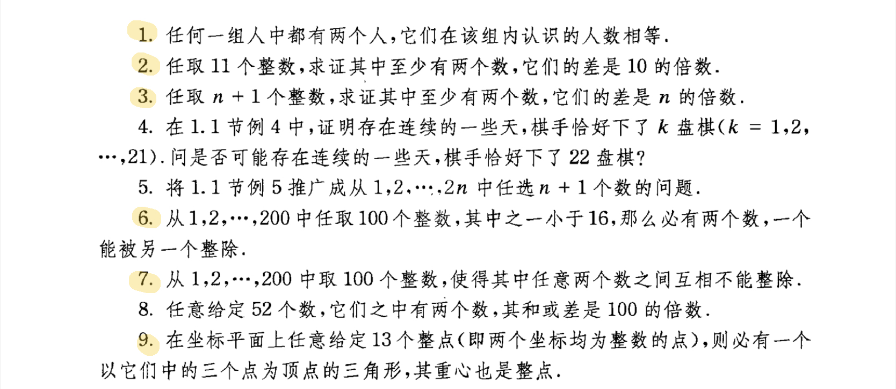

> 王磊 2020211538
> 

### 1.
解：设组内共有n个人，每个人认识的人的数量为$a_1,a_2,…,a_n$，
则有$1\leqslant a_1,a_2,…,a_n\leqslant n-1$，
共有n-1个数，根据鸽巢原理，
一定存在两个人认识的人的个数相等。
### 2.
解：设这11个数为$b_1,b_2,…,b_{11}$,
也可表示为$10k_1+a_1,10k_2+a_2,…,10k_{11}+a_{11}$，
其中k的取值为自然数，$0\leqslant a_1,a_2,…,a_{11}\leqslant 9$,
根据鸽巢原理，一定存在$a_i=a_j(i\neq j)$，
此时$b_i-b_j=10(k_i-k_j)$,
故至少有两个数的差是10的倍数。
### 3.
解：设这n+1个数为$b_1,b_2,…,b_{n+1}$,
也可以表示为$nk_1+a_1,nk_2+a_2,…,nk_{n+1}+a_{n+1}$,
其中k的取值为自然数，$0\leqslant a_1,a_2,…,a_{n+1}\leqslant n-1$,
根据鸽巢原理，一定存在$a_i=a_j(i\neq j)$,
故至少有两个数的差是n的倍数。
### 6.
解：将这两百个数按奇数因子分为100组，表示为
$1,1\times2,1\times4…$
$3,3\times2,3\times4…$
$5,5\times2,5\times4…$
……
$197$
$199$，
假设在有一个数小于16的情况下，这100个数都不能相互整除，
由于每组中的数都能相互整除，故若想取100个数相互不能整除，则要从这100组内每组取一个，
设取的数为：
$a_1=1\times2^{k_1}$
$a_3=3\times2^{k_3}$
…
$a_199=199\times2^{k_199}$
设那个小于16的数为$a_i=i\times2^{k_i}$,
则$a_{3i}=3i\times2^{k_31}$,则必有$k_{3i}\leqslant k_i-1$,
故$a_1<16$,$a_{3i}< 24,…,a_{81i}<81$,
而$a_{81i}=81\times(i\times2^{k_{81i}})\geqslant81$,故矛盾，命题得证。
### 7.
解：将这两百个数按奇数因子分为100组，表示为
$1,1\times2,1\times4…$
$3,3\times2,3\times4…$
$5,5\times2,5\times4…$
……
$197$
$199$，
从每组中选一个数，即可保证互相之间不能整除。
### 9.
解：将13个点的x坐标表示为$k_i\times3+a_i$,则$a_i=0,1,2$,
根据抽屉原理，这三组数中必有一组至少包含五个数，在这五个数中任取三个，他们的重心为整点，
他们的y值也可以这样分为三组，在一组里取三个数或者三组每组取一个数都能保证重心的y坐标为整数，
即证。

