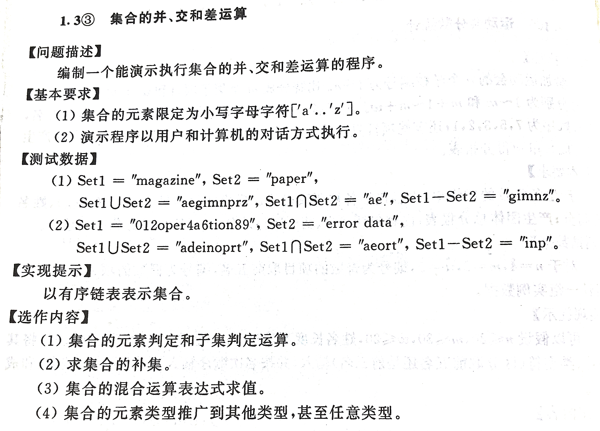
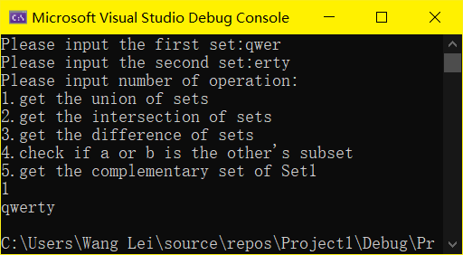
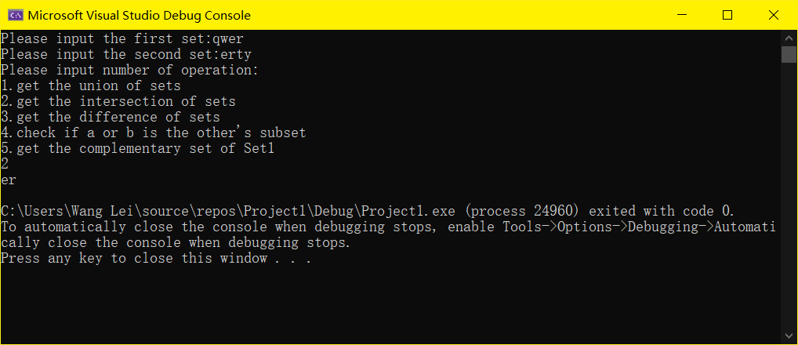
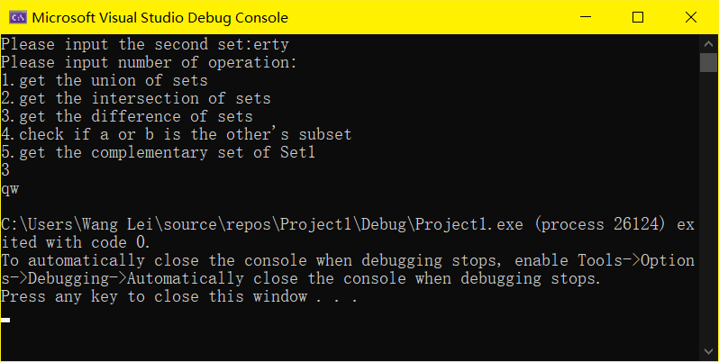
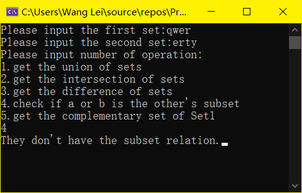
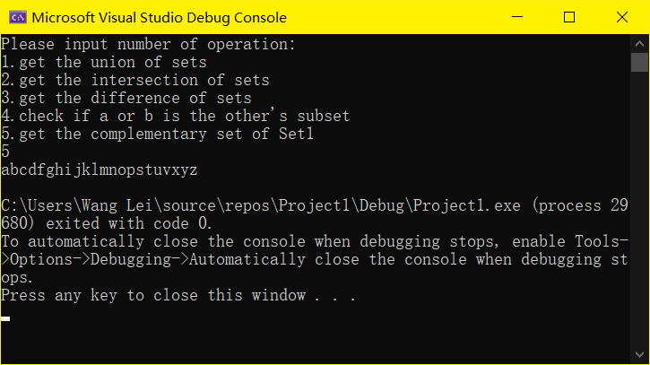

# 数据结构上机实验题实验报告
题目: 《数据结构题集（C语言版）》p80 1.3
姓名：王磊
班级：2020211311
学号：2020211538
提交日期：2021年11月8日
### 一 题目描述
1. 输入形式：可能包含任意字符的两个字符数组。
2. 输出形式：字符集 。
3. 程序功能：读入输入的字符数组，提取出只由小写字母字符构成的两个集合，进行并、交、差的运算，打印运算结果。

### 二 程序设计
1. **定义结构变量set**
```c
typedef struct set {
	char*elem;
	int listsize;
	int len;
}set;
```
2. **基本操作**
```c
set SetInit()
    //集合初始化
set SetInput(set s)
    //集合输入
void SetOutput(set a)
    //集合输出
set SetInsert(set s,int i, char x)
    //将字符x插入到集合s的i位置
set SetDelete(set s, int x)
    //删除集合s中位置为x的元素
set SetGenerate(set s)
    //将s.elem字符数组中非小写字母的元素和重复的元素删除使其变为真正的字符集合
set SetUnion(set a, set b, set c)
    //求a和b的并集，结果储存在c中
set SetIntersection(set a, set b, set c)
    //求a和b的交集，结果储存在c中
set SetDiffer(set a, set b, set c)
    //求a和b的差集，结果储存在c中
int SetJudge(set a, char x)
    //判断字符x是否在集合a中（选做1）
int SubsetJudge(set a, set b)
    //判断a和b之间是否具有子集的关系（选做1）
```
3. **详细设计**
    1. 头文件
```c
#include<stdio.h>
#include<stdlib.h>
```
2. 外部变量定义

```c
#define LIST_INIT_SIZE 100
#define ADD_SIZE 10
```
3. 结构体定义

```c
typedef struct set {
	char*elem;
	int listsize;
	int len;
}set;
```
4. 求集合并集

```c
set SetUnion(set a, set b, set c)
{
	for (int i = 0; i < a.len; i++)
	{
		c = SetInsert(c, c.len, a.elem[i]);
	}
	for (int i = 0; i < b.len; i++)
	{
		c = SetInsert(c, c.len, b.elem[i]);
	}
	c = SetGenerate(c);
	return c;
}
```
5. 求集合交集

```c
set SetIntersection(set a, set b, set c)
{
	for (int i = 0; i < a.len; i++)
	{
		for (int j = 0; j < b.len; j++)
		{
			if (a.elem[i] == b.elem[j])
			{
				c = SetInsert(c, c.len, a.elem[i]);
				break;
			}
		}
	}
	c = SetGenerate(c);
	return c;
}
```
6. 求集合差集

```c
set SetDiffer(set a, set b, set c)
{
	c = a;
	for (int i = 0; i < c.len; i++)
	{
		for (int j = 0; j < b.len; j++)
		{
			if (c.elem[i] == b.elem[j])
			{
				c = SetDelete(c, i+1);
			}
		}
	}
	c = SetGenerate(c);
	return c;
}
```
7. 元素判断和子集判断

```c
int SetJudge(set a, char x)
{
	int j = 0;
	for (int i = 0; i < a.len; i++)
	{
		if (a.elem[i] == x)
		{
			j = 1;
			break;
		}
	}
	return j;
}
int SubsetJudge(set a, set b)
{
	set c;
	c = SetUnion(a, b, c);
	if (c.elem == a.elem)
		return 1;
	else if (c.elem == b.elem)
		return 2;
	else return 0;
}
```
8. 主函数

```c
int main()
{
	set a, b, c,u;
	int n,x;
	u = SetInit();
	u.elem ="abcdefghijklmnopqrstuvwxyz";
	u.len = 26;
	a = SetInit();
	printf("Please input the first set:");
	a = SetInput(a);
	b = SetInit();
	printf("Please input the second set:");
	b = SetInput(b);
	c = SetInit();
	printf("Please input number of operation:\n");
	printf("1.get the union of sets\n2.get the intersection of sets\n3.get the difference of sets\n");
	printf("4.check if a or b is the other's subset\n5.get the complementary set of Set1");

	scanf("%d", &n);
	switch (n)
	{
	case 1:
		c = SetUnion(a, b, c);
		SetOutput(c);
		break;
	case 2:
		c = SetIntersection(a, b, c);
		SetOutput(c);
		break;
	case 3:
		c = SetDiffer(a, b, c);
		SetOutput(c);
		break;
	case 4:
		x = SubsetJudge(a, b);
		if (x == 0)
			printf("They don't have the subset relation.");
		else if (x == 1)
			printf("Set2 is a subset of Set1.");
		else
			printf("Set1 is a subset of Set2.");
	case 5:
		c = SetDiffer(u, a,c);
		SetOutput(c);
		break;
	}
}
```
### 三 调试分析
* 编译环境：Visual Studio2019
* 运行环境：WIN10
   1. 运算"qwer"和"erty"的并集
   
   2. 运算"qwer"和"erty"的交集
    
   3. 运算"qwer"和"erty"的差集
   
   4. 判断"qwer"和"erty"有无子集关系
   
   5. 在自定义全集为Set2的情况下，计算"qwer"的补集
   

### 四 源代码
```javascript {.line-numbers} 
#include<stdio.h>
#include<stdlib.h>
#define LIST_INIT_SIZE 100
#define ADD_SIZE 10
typedef struct set {
	char*elem;
	int listsize;
	int len;
}set;
set SetInit()
{
	set s;
	s.elem =(char*)malloc((LIST_INIT_SIZE) * (sizeof(char)));
	if (!s.elem)exit(-1);
	s.listsize = LIST_INIT_SIZE;
	s.len = 0;
	return s;
}
set SetInput(set s)
{
	gets(s.elem);
	char* new;
	s.len = strlen(s.elem);
	if (s.listsize <= s.len)
	{
		new = (char*)realloc(s.elem, (s.listsize + ADD_SIZE) * sizeof(char));
		s.elem = new;
		s.listsize += ADD_SIZE;
	}
	return s;
}
set SetInsert(set s,int i, char x)
{
	for (int j=i; j + 1 <= s.len; j++)
	{
		s.elem[j] = s.elem[j - 1];
	}
	s.elem[i] = x;
	s.elem[s.len + 1] = '\0';
	s.len++;
	return s;
}                  
set SetDelete(set s, int x)
{
	for (int i = x; i <= s.len; i++)
	{
		s.elem[i - 1] = s.elem[i];
	}
	s.len -= 1;
	return s;
}
set SetGenerate(set s)
{
	for (int i = 0; i < s.len; i++)
	{
		if (s.elem[i] > 'z' || s.elem[i] < 'a')
		{
			s = SetDelete(s, i + 1);
		}
	}
	for (int i = 1; i <= s.len; i++)
	{
		for (int j = 1; j < i; j++)
		{
			if (s.elem[i - 1] == s.elem[j - 1]&& s.elem[i - 1])
			{
				s = SetDelete(s, i);
				i--;
				break;
			}
		}
	}
	return s;
}
set SetUnion(set a, set b, set c)
{
	for (int i = 0; i < a.len; i++)
	{
		c = SetInsert(c, c.len, a.elem[i]);
	}
	for (int i = 0; i < b.len; i++)
	{
		c = SetInsert(c, c.len, b.elem[i]);
	}
	c = SetGenerate(c);
	return c;
}
set SetIntersection(set a, set b, set c)
{
	for (int i = 0; i < a.len; i++)
	{
		for (int j = 0; j < b.len; j++)
		{
			if (a.elem[i] == b.elem[j])
			{
				c = SetInsert(c, c.len, a.elem[i]);
				break;
			}
		}
	}
	c = SetGenerate(c);
	return c;
}
set SetDiffer(set a, set b, set c)
{
	c = a;
	for (int i = 0; i < c.len; i++)
	{
		for (int j = 0; j < b.len; j++)
		{
			if (c.elem[i] == b.elem[j])
			{
				c = SetDelete(c, i+1);
			}
		}
	}
	c = SetGenerate(c);
	return c;
}
int SetJudge(set a, char x)
{
	int j = 0;
	for (int i = 0; i < a.len; i++)
	{
		if (a.elem[i] == x)
		{
			j = 1;
			break;
		}
	}
	return j;
}
int SubsetJudge(set a, set b)
{
	set c;
	int x = 0;
	c = SetInit();
	c = SetUnion(a, b, c);
	for (int i = 0; i < c.len; i++)
	{
		if (c.elem[i] != a.elem[i])
			break;
		if (i == c.len - 1)
			x = 1;
	}
	for (int i = 0; i < c.len; i++)
	{
		if (c.elem[i] != b.elem[i])
			break;
		if (i == c.len - 1)
			x = 2;
	}
	return x;
}


void SetOutput(set a)
{
	puts(a.elem);
}

int main()
{
	set a, b, c;
	int n,x;
	a = SetInit();
	printf("Please input the first set:");
	a = SetInput(a);
	b = SetInit();
	printf("Please input the second set:");
	b = SetInput(b);
	c = SetInit();
	printf("Please input number of operation:\n");
	printf("1.get the union of sets\n2.get the intersection of sets\n3.get the difference of sets\n");
	printf("4.check if a or b is the other's subset\n5.get the complementary set of Set1\n");
	scanf("%d", &n);
	switch (n)
	{
	case 1:
		c = SetUnion(a, b, c);
		SetOutput(c);
		break;
	case 2:
		c = SetIntersection(a, b, c);
		SetOutput(c);
		break;
	case 3:
		c = SetDiffer(a, b, c);
		SetOutput(c);
		break;
	case 4:
		x = SubsetJudge(a, b);
		if (x == 0)
			printf("They don't have the subset relation.");
		else if (x == 1)
			printf("Set2 is a subset of Set1.");
		else
			printf("Set1 is a subset of Set2.");
	case 5:
		c = SetDiffer(b, a,c);
		SetOutput(c);
		break;
	}
}
```
