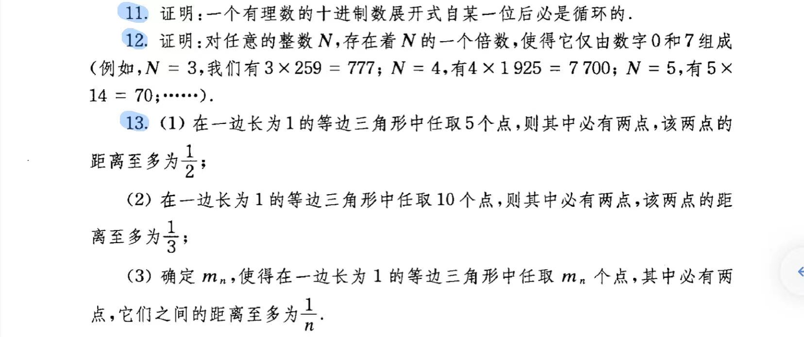

### 11.
解：
### 12.
解：
### 13.
解:
(1) 取三条边的中点各自相连，则原等边三角形被分割为四个边长为$\frac{1}{2}$的小等边三角形，
根据鸽巢原理，至少有两个点在同一个小等边三角形内，
两个点间的距离至多为$\frac{1}{2}$,
原命题得证。
(2)取三条边的三等分点各自相连，则原等边三角形被分割为九个边长为$\frac{1}{3}$的小等边三角形，
根据鸽巢原理，至少有两个点在同一个小等边三角形内，
两个点间的距离至多为$\frac{1}{3}$,
原命题得证。
(3)令$m_n=n^2+1$，
取三条边的n等分点各自相连，
则原等边三角形被分割为$n^2$个边长为$\frac{1}{n}$的小等边三角形，
根据鸽巢原理，至少有两个点在同一个小等边三角形内，
两个点间的距离至多为$\frac{1}{n}$。
### 22.
解：对六个点两两相连，可以得到六个顶点的完全图K6，
对其中所有三角形的最长边染红色，其他边不染色，
易知必然存在红色三角形，此三角形的最短边即满足要求。
